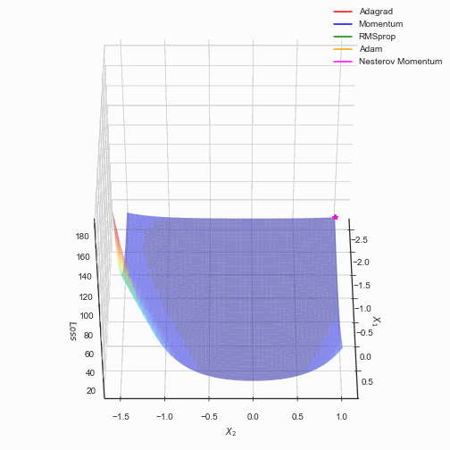

# Introduction

> Zicheng Zhang
>
> 邮箱:zzczzc.1221@gmail.com

## 展示

3D-plot

## 文件结构

* `.ipynb_checkpoints` 配置文件
* `第一次` 第一次大作业文件夹
  * `SVM.pdf` 支持向量机的综述介绍
  * `SVM.py` SMO算法的简单实现
* `第二次` 第二次大作业文件夹
  * `various Gradient Descent .ipynb` 实现了一些目前流行的SGD算法（选做）
  * `steepest gradient.ipynb ` 实现了最速下降在不同范数的下的情况
  * `LineSearch_GD.ipynb` 回溯直线搜索的梯度下降
  * `Newton method.ipynb` 无约束牛顿法
* `第三次` 第三次大作业文件夹
  * `data.py`  数据生成脚本
  * `A.txt,B.txt`数据文件
  *  `convex with equal constraint.ipynb`  可行解和不可行解两种牛顿法
  * `cvx with equal dual.ipynb` 对偶问题的解法

* `优化大作业报告.pdf` 总结报告
